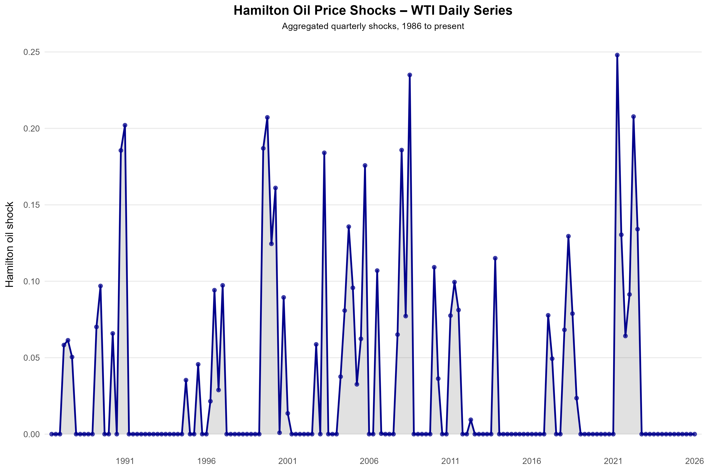
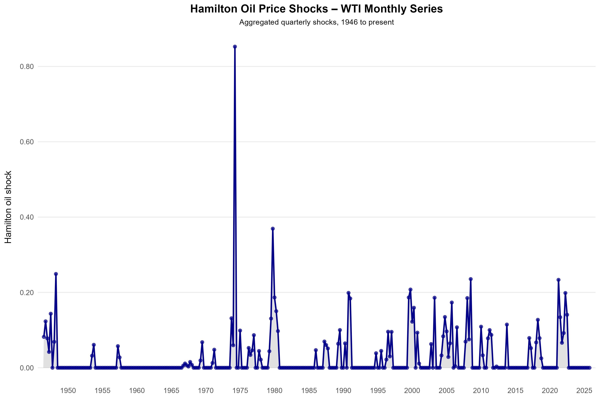

<h1 align="center">Updating Coibion Gorodnichenko Oil Price Shock Series</h1>

  
  &nbsp;&nbsp;
  

This folder contains Hamilton-style oil price shock series constructed from crude oil prices and aggregated to the quarterly frequency

**Script:** `oil_shock_param_creation.R`  

### Data Sources

The oil shock construction relies on FRED series for nominal WTI crude oil prices:

- **Daily WTI prices** (e.g., `DCOILWTICO`)
- **Monthly WTI prices** (e.g., `WTISPLC`) providing a longer historical sample from the mid-1940s onward

### Key Transformations

1. **Quarterly Aggregation**  
   - Each calendar date is mapped to a quarter.  
   - Within each quarter, the average nominal oil price is calculated.  
   - This yields a quarterly series $\( p_t \)$ of oil prices.

2. **Log Transformation**  
   - Prices are converted to logs:
     $$ell_t = log(p_t)$$
   - A small positive constant is used internally to avoid numerical issues when prices are extremely low.

3. **Hamilton Net Oil Price Increase (NOPI)**  
   - For each quarter $\( t \)$, compute the maximum of log prices over the previous four quarters:
     $$M_t = \max(\ell_{t-1}, \ell_{t-2}, \ell_{t-3}, \ell_{t-4})$$
   - The Hamilton-style oil price shock is: $$\text{oilshock}_t = \max(0, \ell_t - M_t)$$
   - Intuitively, this captures **only net increases** in oil prices relative to their recent four-quarter peak, following Hamilton’s original construction.

   ***Note: Quarter Indexing for MATLAB*** 
   - Quarters are converted to a decimal-year format used in Coibion–Gorodnichenko’s MATLAB code:
     - Q1 of year \( y \): \( y + 0.00 \)  
     - Q2: \( y + 0.25 \)  
     - Q3: \( y + 0.50 \)  
     - Q4: \( y + 0.75 \)
   - This produces the first column in the MATLAB `oilshocks` matrix.

### Outputs

The script produces two MATLAB `.m` files:

- **`shocks_oil_prices.m`**  
  - Oil shocks constructed from the **daily** WTI series.  
  - Contains a two-column matrix:
    1. Decimal quarter index  
    2. Hamilton NOPI shock

- **`shocks_oil_price_historic.m`**  
  - Oil shocks constructed from the **monthly** WTI series, providing a longer historical span.  
  - Same two-column structure as above

### WTI-based shocks

  

The **WTI Hamilton shock series** is constructed from your benchmark WTI price series. At a high level:

- Start from the underlying `WTI`FRED price series
- This creates more similar series to C and G, from 1986 to present

### DCOILWTICO-based shocks

  

The **DCOILWTICO Hamilton shock series** is built from the FRED spot price of WTI crude oil (`DCOILWTICO`). The procedure mirrors the WTI series:

- Use `DCOILWTICO` prices
- This creates a longer history dating back to 1946

---

For more details on the exact data sources, transformations, and how these shock series fit into the broader replication/extension of Coibion–Gorodnichenko and related work, see the main project README in the root of this repository.

